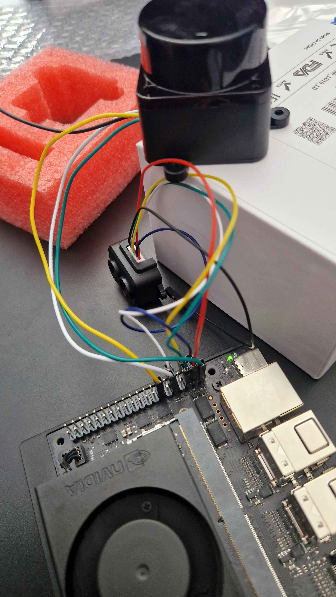

# TF-Luna LiDAR Setup on Jetson Orin Nano

This guide explains how to set up and use the TF-Luna LiDAR with the Jetson Orin Nano using ROS2. The TF-Luna is a single-point ranging LiDAR based on the Time-of-Flight (ToF) principle.

## Hardware Setup

### Pin Connections
The TF-Luna can operate in two communication modes. Choose the appropriate wiring based on your setup:

### Prerequisites
- Jetson Orin Nano
- TF-Luna LiDAR sensor
- Installed ROS2 Humble on Jetson Orin Nano [ROS2 Humble Installation Guide](https://nvidia-isaac-ros.github.io/getting_started/isaac_apt_repository.html)

### TF-Luna Pin Configuration


The TF-Luna has 6 pins with the following functions:


1. **Pin 1 (+5V)** → **Jetson Pin 4 (5V)**
   - Power input (3.7V-5.2V)
   - Average current ≤70mA, Peak current 150mA

2. **Pin 2 (RXD/SDA)** → **For I2C**: Jetson Pin 3 (SDA) | **For UART**: Jetson Pin 10 (RX)
   - I2C Data line (when in I2C mode)
   - UART Receive line (when in UART mode)
   - 3.3V logic level

3. **Pin 3 (TXD/SCL)** → **For I2C**: Jetson Pin 5 (SCL) | **For UART**: Jetson Pin 8 (TX)
   - I2C Clock line (when in I2C mode)
   - UART Transmit line (when in UART mode)
   - 3.3V logic level

4. **Pin 4 (GND)** → **Jetson Pin 6 (GND)**
   - Ground connection

5. **Pin 5 (Interface Config)** → **For I2C**: Jetson Pin 9 (GND) | **For UART**: Leave floating
   - **CRITICAL FOR I2C**: Must be connected to GND for I2C mode
   - **CRITICAL FOR UART**: Leave floating (NC) or connect to 3.3V for UART mode

6. **Pin 6 (Multiplexed Output)**
   - Leave disconnected for basic operation
   - Can be used for switching mode or data ready indication

## Communication Mode Options

### Option 1: I2C Mode (Recommended for Multi-Sensor Setup)

**When to use I2C mode:**
- Running alongside LD19 LiDAR (avoids UART conflicts)
- Multiple sensors on same system
- Better for system integration

**I2C Mode Wiring:**
| TF-Luna Pin | Function | Jetson Pin | Jetson Function | Description |
|-------------|----------|------------|-----------------|-------------|
| 1 | +5V | 4 | 5V | Power supply (3.7V-5.2V) |
| 2 | SDA | 3 | SDA | I2C Data line (3.3V logic) |
| 3 | SCL | 5 | SCL | I2C Clock line (3.3V logic) |
| 4 | GND | 6 | GND | Ground connection |
| 5 | Mode | 9 | GND | **CRITICAL**: Must connect to GND for I2C mode |
| 6 | Output | - | - | Leave disconnected |

### Option 2: UART Mode (Single Sensor Only)

**When to use UART mode:**
- Only using TF-Luna (no LD19 LiDAR)
- Simple single-sensor setup
- Direct serial communication preferred

**UART Mode Wiring:**
| TF-Luna Pin | Function | Jetson Pin | Jetson Function | Description |
|-------------|----------|------------|-----------------|-------------|
| 1 | +5V | 4 | 5V | Power supply (3.7V-5.2V) |
| 2 | RXD | 10 | UART_RX | UART Receive (3.3V logic) |
| 3 | TXD | 8 | UART_TX | UART Transmit (3.3V logic) |
| 4 | GND | 6 | GND | Ground connection |
| 5 | Mode | - | Floating | **CRITICAL**: Leave floating for UART mode |
| 6 | Output | - | - | Leave disconnected |

**⚠️ UART Conflict Warning:**
If you're using LD19 LiDAR, **DO NOT** use UART mode for TF-Luna as both sensors would conflict on pins 8/10.

### Multi-Sensor Setup (with LD19 LiDAR)
If you're also using an LD19 LiDAR, you **MUST** use I2C mode for TF-Luna to avoid UART conflicts:

**Why I2C Mode is Required:**
- LD19 LiDAR uses UART pins 8/10 (ttyTHS1)
- TF-Luna UART mode would also need pins 8/10
- **CONFLICT**: Both sensors cannot share the same UART pins
- **SOLUTION**: Use TF-Luna in I2C mode (pins 3/5)

**Complete Multi-Sensor Pin Assignment:**
```
Pin 2  (5V)      ← LD19 Power              ⚠️ LD19 uses this 5V pin
Pin 3  (SDA)     ← TF-Luna Pin 2 (I2C Data)
Pin 4  (5V)      ← TF-Luna Pin 1 (Power)   ⚠️ TF-Luna uses this 5V pin
Pin 5  (SCL)     ← TF-Luna Pin 3 (I2C Clock)
Pin 6  (GND)     ← Shared Ground for both sensors
Pin 8  (UART_TX) ← LD19 Pin 3 (RX)
Pin 9  (GND)     ← TF-Luna Pin 5 (I2C Mode Select) ⚠️ CRITICAL for I2C
Pin 10 (UART_RX) ← LD19 Pin 1 (TX)
```

**Key Points:**
- **Power**: LD19 uses Pin 2 (5V), TF-Luna uses Pin 4 (5V) - no conflict
- **Communication**: LD19 uses UART (pins 8/10), TF-Luna uses I2C (pins 3/5) - no conflict
- **Ground**: Both share Pin 6 for GND, TF-Luna also uses Pin 9 for mode selection

### Pin Identification
When looking at the TF-Luna sensor from the front (lens side), the pins are typically numbered from left to right (1-6).

## Software Setup

### 1. I2C Configuration
Enable I2C on the Jetson:

```bash
# Enable I2C interface
sudo apt update
sudo apt install -y i2c-tools

# Check I2C buses
sudo i2cdetect -l

# Scan for TF-Luna (should appear at address 0x10 on bus 1 or 7)
sudo i2cdetect -y -r 1
sudo i2cdetect -y -r 7
```

### 2. ROS2 Workspace Setup
```bash
# Create workspace
mkdir -p ~/tf_luna_ros2_ws/src
cd ~/tf_luna_ros2_ws/src

# Clone or create the TF-Luna ROS2 package
# (Package files should already be in your workspace)

# Build workspace
cd ~/tf_luna_ros2_ws
colcon build

# Source workspace
source install/setup.bash
```

### 3. Launch TF-Luna
```bash
# For I2C mode (recommended)
ros2 launch tfluna_ros2 tfluna_i2c_launch.py

# For UART mode (if using UART instead)
ros2 launch tfluna_ros2 tfluna_launch.py
```

## Startup Procedure

1. **Hardware Connection (Most Critical Step)**:
   - **CRITICAL**: Connect Pin 5 to GND before powering on
   - Ensure all connections are secure
   - Double-check power connections (Pin 1 to 5V, Pin 4 to GND)
   - Verify I2C connections (Pin 2 to SDA, Pin 3 to SCL)

2. **Power Cycle After Wiring**:
   - After connecting Pin 5 to GND, power cycle the TF-Luna
   - Wait 5-10 seconds for the sensor to initialize in I2C mode
   - The sensor should appear at address 0x10 on I2C scan

3. **Starting the ROS Node**:
   - Launch the appropriate ROS2 node
   - Wait 2-3 seconds for initialization
   - Check for data output on ROS topics

4. **Successful Operation Signs**:
   - Sensor detected at I2C address 0x10
   - Consistent distance readings
   - No I/O errors in terminal output
   - Data published to `/tfluna/range` and `/tfluna/pointcloud` topics

## Technical Details

### TF-Luna Specifications
- **Type**: Single-point ranging LiDAR
- **Technology**: Time-of-Flight (ToF)
- **Range**: 0.2m - 8m (90% reflectivity), 0.2m - 2.5m (10% reflectivity)
- **Accuracy**: ±6cm (0.2m-3m), ±2% (3m-8m)
- **Distance Resolution**: 1cm
- **Frame Rate**: 1-250Hz (adjustable)
- **Field of View**: 2°
- **Light Source**: 850nm infrared VCSEL
- **Eye Safety**: Class 1 (IEC60825)
- **Operating Temperature**: -10°C to 60°C

### Communication Interfaces
- **I2C**: Default address 0x10, max 400kbps
- **UART**: Default 115200 baud, 8N1
- **I/O Mode**: High/low level output on Pin 6

### Data Output
The TF-Luna ROS2 node publishes data in two formats:

1. **Range** (`/tfluna/range` topic)
   - `sensor_msgs/Range` message type
   - Single distance measurement
   - Includes field of view and range limits
   - Compatible with navigation algorithms

2. **PointCloud2** (`/tfluna/pointcloud` topic)
   - `sensor_msgs/PointCloud2` message type
   - Single 3D point with intensity
   - Compatible with 3D visualization tools
   - Better for Foxglove Studio integration

### Communication Parameters
- **I2C Address**: 0x10 (default)
- **I2C Speed**: Up to 400kHz
- **Data Registers**: 0x00-0x05 (distance and strength)
- **Update Rate**: Configurable, typically 10Hz

### Visualization Options

#### Using RViz2
```bash
# Launch RViz2 with TF-Luna visualization
rviz2
```
- Add Range display for `/tfluna/range` topic
- Add PointCloud2 display for `/tfluna/pointcloud` topic
- Set fixed frame to `tfluna_link`

#### Using Foxglove Studio
1. Install Foxglove Bridge:
```bash
sudo apt install ros-humble-foxglove-bridge
```

2. Launch the bridge:
```bash
ros2 launch foxglove_bridge foxglove_bridge_launch.xml
```

3. Open Foxglove Studio and connect to:
   - WebSocket URL: `ws://localhost:8765`
   - Add Range and PointCloud2 panels
   - Configure 3D visualization

## Troubleshooting

### No Data from TF-Luna
1. **Check I2C Detection**
   ```bash
   sudo i2cdetect -y -r 1
   sudo i2cdetect -y -r 7
   ```
   - TF-Luna should appear at address 0x10
   - If not detected, check wiring and power

2. **Verify Pin 5 Connection**
   - **CRITICAL**: Pin 5 MUST be connected to GND for I2C mode
   - Power cycle the sensor after connecting Pin 5
   - Sensor may disappear from I2C scan if Pin 5 is not properly grounded

3. **Test Manual I2C Read**
   ```bash
   # Read distance registers manually
   sudo i2cget -y 1 0x10 0x00
   sudo i2cget -y 1 0x10 0x01
   ```

### Permission Issues
```bash
# Add user to i2c group
sudo usermod -a -G i2c $USER
sudo chmod a+rw /dev/i2c-*
```

### Critical Hardware Requirements

**Important**: The TF-Luna requires specific hardware configuration for I2C mode.

**Hardware Guidelines:**
1. **Pin 5 Connection (CRITICAL)**
   - Pin 5 MUST be solidly connected to GND for I2C mode
   - Loose or missing GND connection will prevent I2C operation
   - Sensor will not respond to I2C commands without proper Pin 5 grounding

2. **Power Cycle Requirement**
   - After connecting Pin 5 to GND, power cycle the TF-Luna
   - The sensor needs to boot in I2C mode
   - May take 5-10 seconds to initialize properly

3. **I2C Bus Selection**
   - Try both I2C bus 1 and bus 7
   - Different Jetson configurations may use different buses
   - Use `sudo i2cdetect -l` to see available buses

4. **Power Supply**
   - Ensure stable 5V supply (Pin 1 to Jetson Pin 4)
   - Check for voltage drops under load
   - Use short, thick wires for power connections

### Communication Issues

**Symptoms of I2C Problems:**
- Sensor not detected in `i2cdetect` scan
- "Remote I/O error" when reading registers
- Intermittent data reception
- Node startup failures

**Solutions:**
1. **Hardware Check**
   - Verify all connections are secure
   - Ensure Pin 5 is properly grounded
   - Power cycle the sensor
   - Check for loose wires

2. **I2C Bus Issues**
   - Try different I2C buses (1, 7, etc.)
   - Check for I2C conflicts with other devices
   - Reduce I2C clock speed if needed

3. **Protocol Implementation**
   - TF-Luna requires individual register reads
   - Cannot use block read operations
   - Follow Arduino-style I2C protocol

### Multi-Sensor Conflicts

**When Using with LD19 LiDAR:**
- LD19 uses UART on pins 8/10 (ttyTHS1)
- TF-Luna uses I2C on pins 3/5
- LD19 uses Pin 2 for 5V power
- TF-Luna uses Pin 4 for 5V power
- Both share Pin 6 for GND (no conflict)

**Power Pin Assignment:**
- Pin 2 (5V): Reserved for LD19
- Pin 4 (5V): Used for TF-Luna
- Both 5V pins can supply adequate current

## Advanced Configuration

### Changing I2C Address
```bash
# Advanced users can change the I2C address (requires specific commands)
# Default address is 0x10, range is 0x08-0x77
# Consult TF-Luna manual for address change procedures
```

### Frame Rate Adjustment
```bash
# Frame rate can be adjusted via I2C commands
# Default is typically 10Hz
# Range: 1-250Hz depending on application needs
```

## Additional Resources

- [TF-Luna Product Manual](https://www.waveshare.com/wiki/TF-Luna_LiDAR_Range_Sensor)
- [Jetson Orin Nano Pin Documentation](https://docs.nvidia.com/jetson/archives/r35.4.1/DeveloperGuide/text/HR/JetsonOrinNano/PinmuxConfig.html)
- [ROS2 Sensor Messages](https://docs.ros.org/en/humble/p/sensor_msgs/)
- [I2C Tools Documentation](https://manpages.ubuntu.com/manpages/focal/man8/i2cdetect.8.html)

## Notes

1. **Communication Mode**: This guide focuses on I2C mode for better multi-sensor compatibility
2. **Power Requirements**: TF-Luna draws 70mA average, 150mA peak current
3. **Data Format**: Each measurement includes distance and signal strength
4. **Safety**: Always connect/disconnect the sensor when Jetson is powered off
5. **Pin 5 Critical**: The most common issue is forgetting to ground Pin 5 for I2C mode